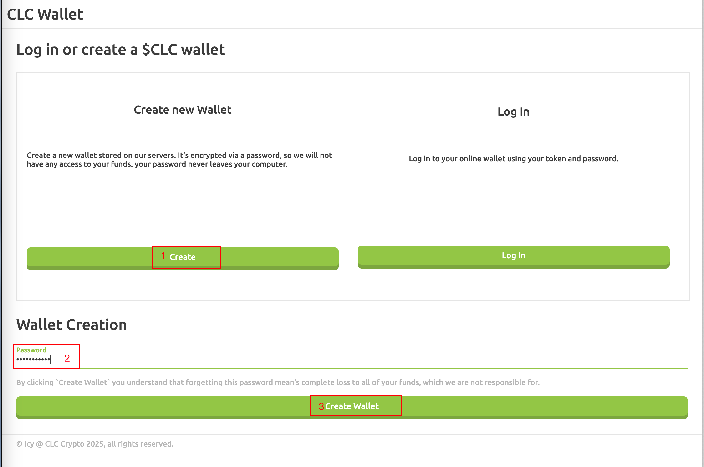
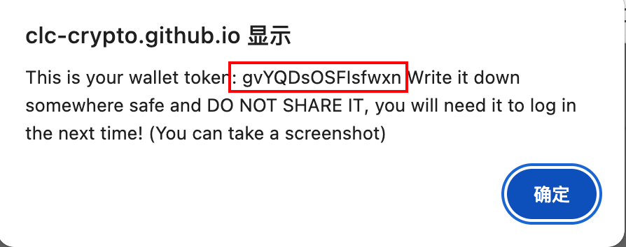

## 声明

本文内容仅供技术探讨，不涉及任何投资建议。相关风险请自行评估和承担。


## CLC 简介

**CPU 矿，预计 2025.04.17 晚11点开放正式网**

网址：https://clc-crypto.github.io/

Discord：https://discord.gg/Zxc68eAm

Github：https://github.com/clc-crypto/

在线钱包：https://clc-crypto.github.io/wallet/

锄头：https://github.com/clc-crypto/clc-miner2/

浏览器：https://clc-crypto.github.io/explore/


## 一键挖矿飞行表

#### 1.说明

官方跟 SOLO 跟池挖矿两种模式

- SOLO 挖矿
  - 挖到的币是保存到本地，需要使用导入钱包后才可以，具体教程会晚点发布
  - 使用飞行表的挖到的币 `/opt/clc_miner/rewards/` 目录下生成 `.coin` 结尾的文件
  - 如果当前文件夹下没有文件，证明还没有爆快
- 池挖矿
  - 挖到的币是在池子里，需要到以下地址将池中余额提取出来，详细教程晚点发布


#### 2.SOLO

> 挖到的币保存在本地，需要导入到钱包
>
> 教程晚点出

```json
{
    "flightName": "CLC",
    "descMsg": "CLC",
    "digitalCash": "CLC",
    "miningPool": "1",
    "miningConfig": "Custom",
    "disableFaultCard": false,
    "customConfig": {
        "customMiner": "clc_miner",
        "customInstallUrl": "https://minerx-download.oss-cn-shanghai.aliyuncs.com/20250416_clc/clc_miner-20250416.5.tar.gz",
        "customAlgo": "---",
        "customTemplate": "%WAL%",
        "customUrl": "https://clc.ix.tc"
    }
}
```


#### 3.官方池

```json

```


#### 4.申请钱包

https://clc-crypto.github.io/login/

- 1.点 Create 创建钱包，下边会提示让输入密码，然后点 Create Wallet
- 2.点击后会有图弹出窗口，红色截图部分相当于钱包私钥，请保留好，切勿遗忘和泄漏








## minerX 社区

官网 - 主站点：https://minerx.vip

官网 - 备用站：http://47.97.210.214:8888/

Telegram 好友：https://t.me/minerx_vip

Telegram 加群：https://t.me/minerX_group


