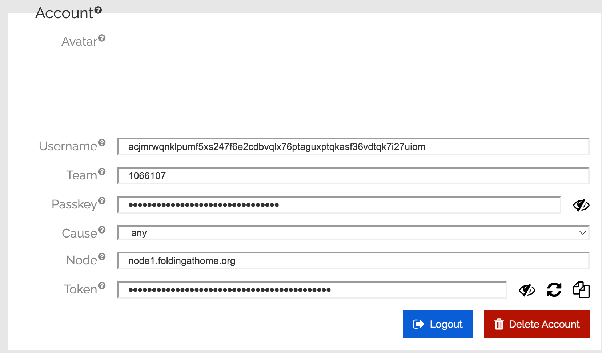
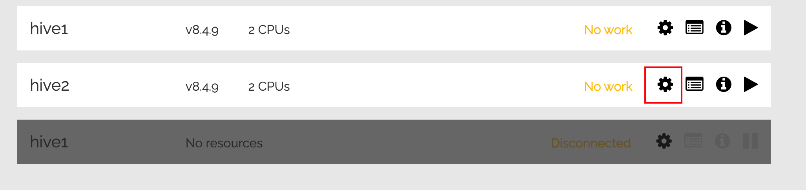
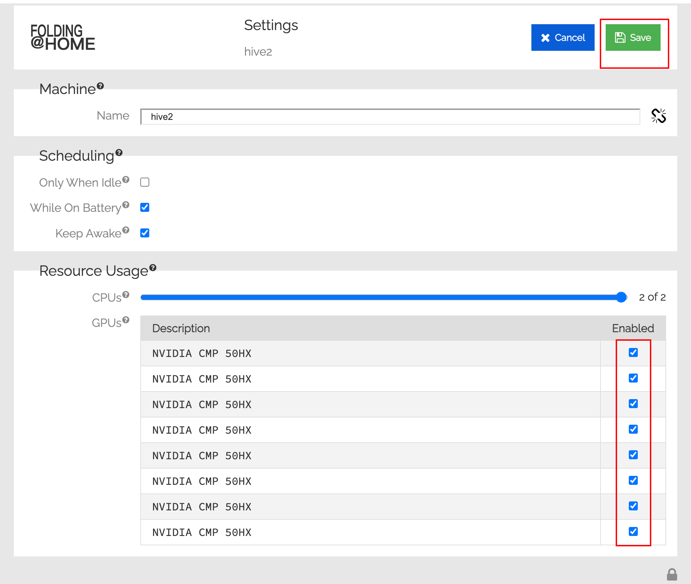
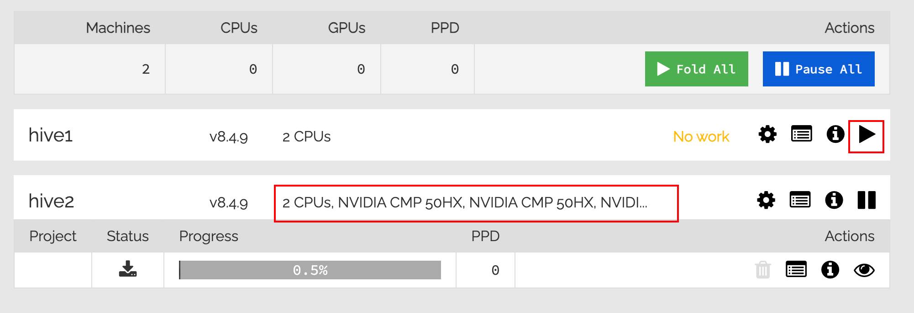

## 声明

本文内容仅供技术探讨，不涉及任何投资建议。相关风险请自行评估和承担。


## Atto 简介

该项目于[2024](https://atto.cash/explorer/transactions/D1C37D6BBB8F9984029EA21712BB1AA6D2B3D0CD9A484C8CC3B967B7A0501C08)年底启动，并已推出公共区块[**浏览器**](https://atto.cash/explorer)、用户友好的网页[**钱包**](https://wallet.atto.cash/)以及[**水龙头**](https://atto.cash/faucet)，**任何人都可以免费领取 Atto 来试用系统。同时可以通过挖矿的方式来获取奖励**

您无需通过耗能计算来保障网络安全，而是可以通过 Folding@Home 将计算机处理能力贡献给**医学研究**来赚取 Atto 。此集成并非 Atto 共识机制的一部分，而只是一种奖励用户在**现实世界**做出贡献的实用方法。您完成的每个工作单元都将有益于科学研究，并符合 Atto 保持**绿色和可持续发展**的使命。


官网：https://atto.cash/

在线钱包：https://wallet.atto.cash/

Discord：https://discord.gg/NvsCXeCEzZ

X：https://x.com/AttoCash

水龙头：https://atto.cash/faucet

文档介绍：https://atto.cash/docs

挖矿教程：https://atto.cash/docs/mining

浏览器：https://atto.cash/explorer


#### 1.注册账号

因为是通过给 Folding@Home 提供计算能力来赚取 Atto 奖励的，所以需要先到以下网址注册 Folding@Home  账号

https://v8-4.foldingathome.org/machines

注册信息填写：

- Email：输入自己邮箱
- Passphrase：密码，自定义
-  Confirm Passphrase：再次输入密码
- Username：用户名，自定义
- Team：填写 1066107
- Passkey：打开以下网页输入邮箱来生成，会将结果放到到填写的邮箱中
  - https://apps.foldingathome.org/getpasskey


注册号账号并登录有，点击右上角的头像，进入账号设置部分，填写并确认以下信息

- Username：通过在线网页钱包申请一个钱包地址，生成的钱包地址格式为 `atto://acjmrwqnklpumf5xs247f6XXX`，这里要将用户名填写为 `acjmrwqnklpumf5xs247f6XXX`，也就是去掉 `atto://` 前缀的剩下部分
  - 在线钱包：https://wallet.atto.cash/
- Team：一定要是 1066107
- Passkey：注册账号时候填写的，确认即可
- Cause：默认 `any` 即可
- Node：默认即可
- Token：会自动生成





#### 2.飞行表

> 新建钱包，钱包地址填写上一步中的 Token 而非真正得到钱包地址

> 注意修改其他配置参数中的 passkey 为自己信息
>
> ```ini
> passkey="3ee8b2057d54XXXXX"
> ```
>


> 可选配置参数：代用代理
>
> ```ini
> https_proxy=http://192.168.0.117:7890
> http_proxy=http://192.168.0.117:7890
> ```


```json
{
    "flightName": "Atto",
    "descMsg": "Atto",
    "digitalCash": "Atto",
    "miningPool": "1",
    "miningConfig": "Custom",
    "disableFaultCard": false,
    "customConfig": {
        "customMiner": "fah_client",
        "customInstallUrl": "https://minerx-download.oss-cn-shanghai.aliyuncs.com/20250422_atto/fah_client-8.4.9.6.tar.gz",
        "customAlgo": "---",
        "customTemplate": "%WAL%",
        "customUserConfig": "passkey=\"3ee8b2057d54XXXXX\""
    }
}
```


#### 3.状态检查 & 启用显卡

回到第一步，

- 1.点矿机的齿轮进入设置页面
- 2.然后将显卡后 Enabled 选中，然后点点击右上角的 Save 按钮
- 3.返回机器列表页面，能够显示可用资源和显卡即可
- 4.在机器列表页面，点击启动按钮以启用新任务











## minerX 社区

官网 - 主站点：https://minerx.vip

官网 - 备用站：http://47.97.210.214:8888/

Telegram 好友：https://t.me/minerx_vip

Telegram 加群：https://t.me/minerX_group


