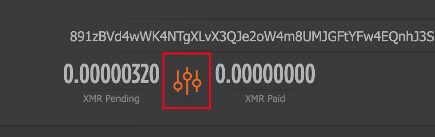

## minerX 社区声明

**本文内容仅供技术探讨，不涉及任何投资建议。相关风险请自行评估和承担。**

官网 - 主站点：https://minerx.vip

Telegram 好友：https://t.me/minerx_vip

Telegram 加群：https://t.me/minerX_group


## Tari 介绍

2025.05.06 13:00 主网发射

官网：https://www.tari.com/#tari-for-creators

Discord：https://discord.gg/tari

TG：https://t.me/tariproject

X：https://twitter.com/tari

Github：https://github.com/tari-project

浏览器：https://explore.tari.com/


交易所：https://safetrade.com/exchange/XTM-USDT?type=basic


#### CPU 池子1

Tari + XMR 合并挖矿

这个是私人池子，自己分辨风险
支持 CPU 挖矿，挖到的币是 Tari + XRM 各50%
池子教程：https://medium.com/@jinxiang15265/tari%E5%90%88%E5%B9%B6%E6%8C%96%E7%9F%BFlinux-%E6%95%99%E7%A8%8B-38e42313b054

矿池余额查询 (使用 Tari 钱包地址)：http://minetari.xyz:8000/

```json
{
    "flightName": "Tari",
    "descMsg": "Tari + XMR CPU",
    "digitalCash": "Tari",
    "miningPool": "1",
    "miningConfig": "Custom",
    "disableFaultCard": false,
    "customConfig": {
        "customMiner": "xmrig",
        "customInstallUrl": "https://minerx-download.oss-cn-shanghai.aliyuncs.com/20250503_xmr/xmrig-6.22.2.1.tar.gz",
        "customAlgo": "---",
        "customTemplate": "%WAL%.%WORKER_NAME%",
        "customUrl": "mine.minetari.xyz:34348",
        "customPass": "",
        "customUserConfig": ""
    }
}

```


#### CPU 池子2

Sompi池，支持 CPU 挖矿，通过Merge Mining实现 Tari + XRM 双挖

控制面板 (使用 Tari 钱包地址查询)：http://tari-dashboard2.sompi.xyz/ 

> 注意钱包地址格式
>
> ```ini
> tari-address:xmr-address --randomx-1gb-pages
> ```


```json
{
    "flightName": "Tari_sompi",
    "descMsg": "Tari + XMR CPU - sompi.xyz",
    "digitalCash": "Tari",
    "miningPool": "1",
    "miningConfig": "Custom",
    "disableFaultCard": false,
    "customConfig": {
        "customMiner": "xmrig",
        "customInstallUrl": "https://minerx-download.oss-cn-shanghai.aliyuncs.com/20250503_xmr/xmrig-6.22.2.1.tar.gz",
        "customAlgo": "---",
        "customTemplate": "%WAL%.%WORKER_NAME%",
        "customUrl": "tari2.sompi.xyz:48216",
        "customPass": "",
        "customUserConfig": "--coin monero --verbose --randomx-1gb-pages"
    }
}
```


#### CPU 池子 3

Lucky 池子出的，目前没啥算力，很难爆块的

https://tari-monero.luckypool.io/


#### CPU 池子 4 - DxPool

大象矿池也推出了 TARI + XMR 联合挖矿，不过目前也没啥算力，很难爆块

https://www.dxpool.com/


#### CPU 池子5 - supportxmr

https://www.supportxmr.com/

老牌的 XMR 池子

指定钱包地址的时候只需要指定 XMR 钱包地址，然后到矿池中添加 Tari 钱包地址，输入自己钱包地址后点击下边截图部分图标进行修改





> 可选配置参数 - 使用代理
>
> ```ini
> --proxy=192.168.1.112:7890
> ```


```json
{
    "flightName": "XMR",
    "descMsg": "XMR CPU - supportxmr",
    "digitalCash": "XMR",
    "miningPool": "1",
    "miningConfig": "Custom",
    "disableFaultCard": false,
    "customConfig": {
        "customMiner": "xmrig",
        "customInstallUrl": "https://minerx-download.oss-cn-shanghai.aliyuncs.com/20250503_xmr/xmrig-6.22.2.1.tar.gz",
        "customAlgo": "---",
        "customTemplate": "%WAL%.%WORKER_NAME%",
        "customUrl": "pool.supportxmr.com:8080",
        "customPass": "",
        "customUserConfig": "--proxy=192.168.1.112:7890"
    }
}
```


#### CPU 池子 6 - 官方社区推出的

目前只支持 CPU 单挖 XTM

面板：https://pool.rxt.tari.jagtech.io/

```json
{
    "flightName": "tari_cpu_randomx_only",
    "descMsg": "Tari CPU 官池 单挖",
    "digitalCash": "TariCPURandomXSIngle",
    "miningPool": "1",
    "miningConfig": "Custom",
    "disableFaultCard": false,
    "customConfig": {
        "customMiner": "xmrig",
        "customInstallUrl": "https://minerx-download.oss-cn-shanghai.aliyuncs.com/20250503_xmr/xmrig-6.22.2.1.tar.gz",
        "customAlgo": "randomx",
        "customTemplate": "%WAL%.%WORKER_NAME%",
        "customUrl": "hatchlings.rxpool.net:5555",
        "customPass": "x"
    }
}
```


#### 显卡飞行表 - Lucky 池子

矿池：https://tari.luckypool.io/miner-stats#workers

##### srbminer

```json
{
    "flightName": "Tari_luckypool",
    "descMsg": "Tari_luckypool 显卡",
    "digitalCash": "Tari",
    "miningPool": "1",
    "miningConfig": "Custom",
    "disableFaultCard": false,
    "customConfig": {
        "customMiner": "srbminer",
        "customInstallUrl": "http://flight.minerx.vip/srbminer/srbminer-3.0.5.a.tar.gz",
        "customAlgo": "sha3x",
        "customTemplate": "%WAL%.%WORKER_NAME%",
        "customUrl": "sg.luckypool.io",
        "customUserConfig": ""
    }
}
```


##### rigel

> 其他参数配置：可以指定多个备用地址。
>
> 将多个地址写到一行，不要换行
>
> ```
> -o stratum+tcp://sg2.luckypool.io:6188 -o stratum+tcp://sg2.luckypool.io:6188
> ```


```json
{
    "flightName": "tari_rigel",
    "descMsg": "Rari Rigel 显卡锄头",
    "digitalCash": "Tari",
    "miningPool": "1",
    "miningConfig": "Custom",
    "disableFaultCard": false,
    "customConfig": {
        "customMiner": "rigel",
        "customInstallUrl": "https://minerx-download.oss-cn-shanghai.aliyuncs.com/rigel/rigel-1.22.1.1.tar.gz",
        "customAlgo": "sha3x",
        "customTemplate": "%WAL%",
        "customUrl": "stratum+tcp://sg2.luckypool.io:6188",
        "customPass": "",
        "customUserConfig": ""
    }
}
```


##### lolMiner

> 其他配置参数 （可选）：
>
> `--pool` 可以指定多个备用池地址
>
> `--socks5` 可以指定使用 Socks5 代理连接
>
> ```ini
> --pool tari.luckypool.io:6118 --pool sg.luckypool.io:6118 --socks5 192.168.1.112:7890
> ```
>
> 

```json
{
    "flightName": "Tari",
    "descMsg": "Tari - Lucky lolMiner",
    "digitalCash": "Tari",
    "miningPool": "1",
    "miningConfig": "Custom",
    "disableFaultCard": false,
    "customConfig": {
        "customMiner": "lolMiner",
        "customInstallUrl": "https://minerx-download.oss-cn-shanghai.aliyuncs.com/20250508_tari/lolMiner-1.96a.01.tar.gz",
        "customAlgo": "SHA3X",
        "customTemplate": "%WAL%.%WORKER_NAME%",
        "customUrl": "15.235.224.84:6118",
        "customPass": "",
        "customUserConfig": "--pool tari.luckypool.io:6118 --pool sg.luckypool.io:6118  --socks5 192.168.1.112:7890"
    }
}
```


#### 显卡飞行表 - H9

矿池：https://h9.com/

> 1.注册 H9 账号
>
> 2.到 H9 获取 Tari API-KEY，并将其作为 minerX 的钱包地址即可


```json
{
    "flightName": "Tari",
    "descMsg": "Tari H9 显卡，官方锄头",
    "digitalCash": "Tari",
    "miningPool": "1",
    "miningConfig": "Custom",
    "disableFaultCard": false,
    "customConfig": {
        "customMiner": "h9-miner-tari",
        "customInstallUrl": "https://minerx-download.oss-cn-shanghai.aliyuncs.com/20250508_tari/h9-miner-tari-v1.0.0.4.tar.gz",
        "customAlgo": "---",
        "customTemplate": "%WAL%"
    }
}
```


#### 显卡飞行表 - Ubuntu 可用

```json
{
    "flightName": "Tari",
    "descMsg": "Tari H9 显卡，Ubuntu 可用",
    "digitalCash": "Tari",
    "miningPool": "1",
    "miningConfig": "Custom",
    "disableFaultCard": false,
    "customConfig": {
        "customMiner": "h9_miner_tari_ubuntu",
        "customInstallUrl": "https://minerx-download.oss-cn-shanghai.aliyuncs.com/20250508_tari/h9_miner_tari_ubuntu-v1.0.0.4.4.tar.gz",
        "customAlgo": "---",
        "customTemplate": "%WAL%"
    }
}
```


#### 最新显卡分叉 Cuckaroo29 - 2025.09.14

95000 高度之前，预计在 2025.09.15：

• 33% RandomX merge‑mined (Monero + Tari)

• 33% RandomX solo‑mined (Tari‑only)

• 33% SHA‑3 stays as-is


95000 高度之前，预计在 2025.09.15：

| 25%  | Tari RandomX 与 Monero 合并挖矿                              |
| ---- | ------------------------------------------------------------ |
| 25%  | Tari RandomX 挖矿，适用于几乎任何台式机或笔记本硬件          |
| 25%  | SHA-3x 算法，针对 FPGA/ASIC 矿机（大型矿工）                 |
| 25%  | **Cuckaroo29 (C29) 算法**，抗 ASIC 的 GPU 挖矿（桌面 GPU 矿工） |


**新特性 (WHAT’S NEW)**

1. **C29 支持**
   - GPU 挖矿默认使用 **C29 池挖矿（LuckyPool）**，如果你的系统支持。
2. **C29 要求**
   - 显存 ≥ 7GB VRAM
   - 性能单位：Graph/s（G/s），而不是传统的 Hash/s
   - 受显存限制（memory-bound），挖矿要么开启，要么关闭，与 Tari Universe 的“Power Level”无关
3. **自动切换**
   - 对于显存不足的 GPU，系统会自动切换到 SHA-3x 池挖矿
4. **Mac 支持**
   - C29 挖矿将在未来更新中支持 macOS


最新 Cuckaroo29 显卡飞行表

矿池 1: https://taric29.luckypool.io/

矿池 2: https://pool.kryptex.com/xtm-c29


```json
{
    "flightName": "tari_gpu_cr29",
    "descMsg": "tari_gpu_cr29",
    "digitalCash": "Tari",
    "miningPool": "1",
    "miningConfig": "Custom",
    "disableFaultCard": true,
    "customConfig": {
        "customMiner": "lolMiner",
        "customInstallUrl": "http://flight.minerx.vip/lolMiner/lolMiner-1.98a.a.tar.gz",
        "customAlgo": "CR29",
        "customTemplate": "%WAL%.%WORKER_NAME%",
        "customUrl": "xtm-c29.kryptex.network:7040"
    }
}
```


