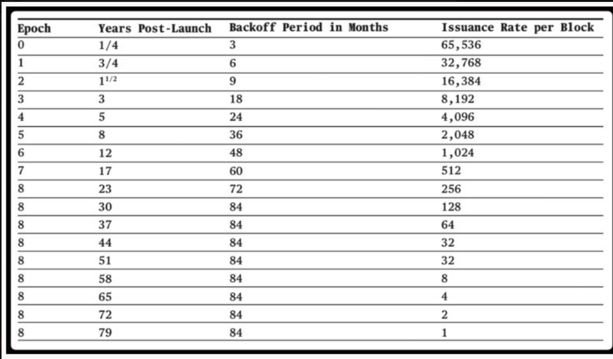

## minerX 社区声明

本文内容仅供技术探讨，不涉及任何投资建议。相关风险请自行评估和承担。

官网 - 主站点：https://minerx.vip

官网 - 备用站：http://47.97.210.214:8888/

Telegram 好友：https://t.me/minerx_vip

Telegram 加群：https://t.me/minerX_group


## Nockchain 简介

> **目前只支持 CPU**


官网：https://www.nockchain.org/

Discord（非官方）：https://discord.com/invite/uBjg2Jg87z

X：https://x.com/nockchain

TG：https://t.me/nockchainproject

论坛：https://forum.nockchain.org/

GitHub：https://github.com/zorp-corp/nockchain

GPT：https://chatgpt.com/g/g-67e0364455a08191adcf5e1d134b6ea2-nockchain-guide/c/681cfd4a-3378-8013-b8f8-4739cf467d23


---


- 最大供应：4294967296
- 区块时间：10分钟
- 区块奖励：最开始每个区块奖励 65536
  - 减半周期：3个月、6个月、9个月、18个月


- 没有预挖，公平启动
- 目前只支持 CPU，后期可能会将其移植到显卡和 FPGA 上
- 官方推荐 16G内存、200G 硬盘和快速 CPU，Mac mini 可能是个不错的选择





#### 1.创建钱包

```sh
## 生成钱包
## 主要保存助记词、私钥和公钥
## 公钥是你的钱包地址，私钥用于签名交易。
nockchain-wallet keygen
```


```ini
## 生成钱包示例输出
2025-05-17T03:38:22.265525Z DEBUG nockapp::kernel::boot: Created jams directory: "/root/.nockapp/wallet/wallet/checkpoints"
2025-05-17T03:38:22.265641Z  INFO nockapp::kernel::boot: kernel: starting
2025-05-17T03:38:22.265676Z DEBUG nockapp::kernel::boot: kernel: pma directory: "/root/.nockapp/wallet/wallet/pma"
2025-05-17T03:38:22.265695Z DEBUG nockapp::kernel::boot: kernel: jam buffer paths: "/root/.nockapp/wallet/wallet/checkpoints/0.chkjam", "/root/.nockapp/wallet/wallet/checkpoints/1.chkjam"
2025-05-17T03:38:22.274267Z  INFO nockapp::kernel::form: No existing state found - initializing fresh state
2025-05-17T03:38:26.672438Z  INFO slogger: [%build-hash 0vh.v44sp]
2025-05-17T03:38:27.069563Z DEBUG gnort::registry: Falling back to delay time default, GNORT_DELAY_MILLIS wasn't specified and delay wasn't set in the code.
2025-05-17T03:38:27.069613Z DEBUG gnort::registry: Falling back to delay time default, GNORT_OBSERVATION_PERIOD_MILLIS wasn't specified and delay wasn't set in the code.
2025-05-17T03:38:27.070093Z DEBUG run_no_join: nockapp::nockapp: Starting nockapp run
2025-05-17T03:38:27.070191Z DEBUG next_effect: nockapp::nockapp::driver: Waiting for recv on next effect
2025-05-17T03:38:27.070191Z DEBUG next_effect: nockapp::nockapp::driver: Waiting for recv on next effect
2025-05-17T03:38:27.070197Z TRACE run_no_join: nockapp::nockapp: Action channel received
2025-05-17T03:38:27.070216Z DEBUG nockapp::drivers::exit: exit_driver: waiting for effect
2025-05-17T03:38:27.070251Z DEBUG next_effect: nockapp::nockapp::driver: Waiting for recv on next effect
## 这里是助记词，请保存好
2025-05-17T03:39:27.193258Z DEBUG poke{wire_source="one-punch"}:do_poke:slam:interpret: slogger: wallet: memo: earth scene tragic crater unveil frequent disagree fashion sauce whale judge plunge kite ketchup gift target success choose test million always purity magic cotton
2025-05-17T03:40:24.263115Z DEBUG poke{wire_source="one-punch"}:do_poke:slam:interpret: slogger: wallet: adding key at /keys/~~2m~44.~57.yzz4s9~4a.ch~42.j~44.a~57.~43.~4d.~4b.3j9rusfs4x~5a.~50.9ebt~4a.~54.~4d.~48.m9~55.a3ap~4e.c~4b.~53.d~4e.~45.o2rrf~4a.q~4d.~48.ob~57.ensh9~50.w~44.p~43.bwcx6yvne~51.8~48.~42.gtc49vc~50.j~53.c~58.~48.~44.oe~46.12~51.5u~4d.e~52.7hgkx~48.~43.~42.~42.~44.~4e.f~57.vt~4c.g/pub/m
2025-05-17T03:40:24.281354Z DEBUG poke{wire_source="one-punch"}:do_poke:slam:interpret: slogger: wallet: adding key at /keys/~~2m~44.~57.yzz4s9~4a.ch~42.j~44.a~57.~43.~4d.~4b.3j9rusfs4x~5a.~50.9ebt~4a.~54.~4d.~48.m9~55.a3ap~4e.c~4b.~53.d~4e.~45.o2rrf~4a.q~4d.~48.ob~57.ensh9~50.w~44.p~43.bwcx6yvne~51.8~48.~42.gtc49vc~50.j~53.c~58.~48.~44.oe~46.12~51.5u~4d.e~52.7hgkx~48.~43.~42.~42.~44.~4e.f~57.vt~4c.g/prv/m
2025-05-17T03:40:27.153041Z DEBUG poke{wire_source="one-punch"}:do_poke:slam:interpret: slogger: wallet: keygen: private key: base58 "6Nn9TJ38dATcB7ebxQYpAmPNMfmiqyGNpAMKLvdKm5uk"
2025-05-17T03:40:27.154384Z DEBUG poke{wire_source="one-punch"}:do_poke:slam:interpret: slogger: wallet: keygen: new private key 36.126.153.152.745.729.684.775.830.184.627.094.870.611.724.990.660.303.237.958.805.565.907.745.582.531
2025-05-17T03:40:27.156312Z DEBUG poke{wire_source="one-punch"}:do_poke:slam:interpret: slogger: wallet: keygen: public key: base58 "2mDWyzz4s9JchBjDaWCMK3j9rusfs4xZP9ebtJTMHm9Ua3apNcKSdNEo2rrfJqMHobWensh9PwDpCbwcx6yvneQ8HBgtc49vcPjScXHDoeF12Q5uMeR7hgkxHCBBDNfWvtLg"
2025-05-17T03:40:27.161397Z DEBUG poke{wire_source="one-punch"}:do_poke:slam:interpret: slogger: wallet: keygen: new public key 0x1.28ba.b7cf.4c7d.e6c2.94da.6256.bd5b.ca49.6413.e743.8fc9.cba5.81f4.1a2b.20de.fde4.68c5.eee2.1231.d1db.a734.024a.fae3.b09f.e816.2122.3c9c.c495.c0ff.50ef.e372.8a15.f15b.dff0.f5ab.1d94.c84e.0c85.5d6d.6192.2842.26c6.2084.1a09.bdaf.1b02.685c.c8b9
2025-05-17T03:40:28.312104Z DEBUG poke{wire_source="one-punch"}:do_poke:slam:interpret: slogger: wallet: no pending commands to execute
2025-05-17T03:40:28.312275Z DEBUG poke{wire_source="one-punch"}:do_poke:slam:interpret: slogger: wallet: cause: %keygen
2025-05-17T03:40:28.312387Z DEBUG poke{wire_source="one-punch"}:do_poke:slam:interpret: slogger: wallet: wire: [~.one-punch 1 /]
2025-05-17T03:40:28.312671Z  WARN poke{wire_source="one-punch"}:do_poke:slam:interpret: slogger: WARN: !! debug printing may expose sensitive information !!
2025-05-17T03:40:30.999560Z DEBUG nockapp::drivers::one_punch: Poke successful
2025-05-17T03:40:30.999607Z DEBUG next_effect: nockapp::nockapp::driver: Waiting for recv on next effect
2025-05-17T03:40:30.999648Z DEBUG next_effect: nockapp::nockapp::driver: Waiting for recv on next effect
2025-05-17T03:40:30.999675Z DEBUG next_effect: nockapp::nockapp::driver: Waiting for recv on next effect
2025-05-17T03:40:30.999696Z DEBUG next_effect: nockapp::nockapp::driver: Waiting for recv on next effect
Keygen

## 这里是钱包的私钥和公钥
New Public Key
"2mDWyzz4s9JchBjDaWCMK3j9rusfs4xZP9ebtJTMHm9Ua3apNcKSdNEo2rrfJqMHobWensh9PwDpCbwcx6yvneQ8HBgtc49vcPjScXHDoeF12Q5uMeR7hgkxHCBBDNfWvtLg"

New Private Key
"6Nn9TJ38dATcB7ebxQYpAmPNMfmiqyGNpAMKLvdKm5uk"

2025-05-17T03:40:30.999862Z DEBUG next_effect: nockapp::nockapp::driver: Waiting for recv on next effect
2025-05-17T03:40:30.999886Z DEBUG next_effect: nockapp::nockapp::driver: Waiting for recv on next effect
2025-05-17T03:40:32.592961Z DEBUG run_no_join: nockapp::nockapp: Exit signal received
2025-05-17T03:40:32.593026Z  INFO run_no_join:handle_exit: nockapp::nockapp: Exit signal received with code 0, forcing immediate save
2025-05-17T03:40:32.615605Z TRACE nockapp::nockapp: Write to "/root/.nockapp/wallet/wallet/checkpoints/0.chkjam" successful, checksum: 8976f4ecab0ff6aab99999b9ddadb28fb380a159d4f681191969e51e10eaa2da, event: 1
2025-05-17T03:40:34.244384Z DEBUG run_no_join:handle_exit: nockapp::nockapp: Exit request received, waiting for save checkpoint with event_num 1 (code 0)
2025-05-17T03:40:34.244549Z DEBUG nockapp::nockapp: Save event_num reached, finishing with code 0
2025-05-17T03:40:34.244567Z DEBUG nockapp::nockapp: Sending shutdown result
2025-05-17T03:40:34.244602Z DEBUG run_no_join: nockapp::nockapp: Shutdown channel received
2025-05-17T03:40:34.244629Z DEBUG run_no_join: nockapp::nockapp: Shutdown triggered, exiting
2025-05-17T03:40:34.244650Z DEBUG nockapp::nockapp: Awaiting serf stop
2025-05-17T03:40:34.267729Z TRACE nockapp::nockapp: Write to "/root/.nockapp/wallet/wallet/checkpoints/1.chkjam" successful, checksum: 8976f4ecab0ff6aab99999b9ddadb28fb380a159d4f681191969e51e10eaa2da, event: 1
2025-05-17T03:40:34.345827Z DEBUG nockapp::kernel::form: Serf finished
2025-05-17T03:40:34.345868Z DEBUG nockapp::nockapp: Joining serf thread
2025-05-17T03:40:34.345905Z DEBUG nockapp::nockapp: Serf thread joined
```


```sh
## 生成新的秘钥对
nockchain-wallet keygen

## 导入私钥
# 从 jam 文件中
nockchain-wallet import-keys --input path/to/keys.jam
# 导入主公钥和链码
nockchain-wallet import-master-pubkey --key <base58-key> --knot <base58-chain-code>

## 从助记词生成私钥
nockchain-wallet gen-master-privkey --seedphrase "your seed phrase here"

## 使用私钥生成公钥
nockchain-wallet gen-master-pubkey --master-privkey <private-key>

## 派生子密钥（Child Key）
## 从主密钥派生子密钥。你可以指定派生公钥或私钥，以及子索引（最多 256 个子密钥）。
nockchain-wallet derive-child --key-type <pub|priv> --index <0-255>
```


```sh
## 连接到 Nockchain 网络
## 钱包操作如：查询余额、广播交易等，都需要连接到运行中的 Nockchain 节点。
# 使用 Unix 域套接字连接 Nockchain 节点
nockchain-wallet --nockchain-socket ./test-leader/nockchain.sock <命令>
```

