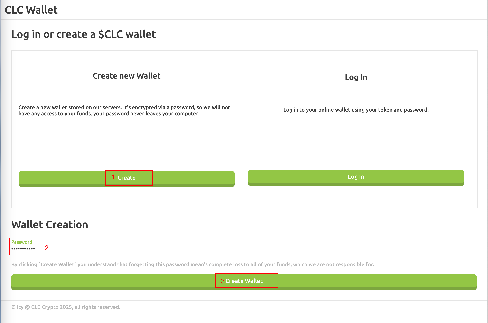
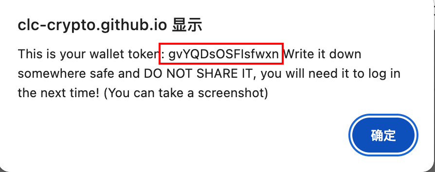

## Disclaimer

The content of this document is for technical discussion only and does not constitute any investment advice. Please assess and bear the relevant risks yourself.


## Introduction to CLC

**CPU mining, mainnet is expected to launch on April 17, 2025, at 11:00 PM**

Website: https://clc-crypto.github.io/

Discord: https://discord.gg/Zxc68eAm

GitHub: https://github.com/clc-crypto/

Web Wallet: https://clc-crypto.github.io/wallet/

Miner: https://github.com/clc-crypto/clc-miner2/

Explorer: https://clc-crypto.github.io/explore/


## One-Click Mining Flight Sheet

#### 1. Description

The official setup supports two modes: SOLO mining and Pool mining.

- SOLO Mining
  - Coins mined are stored locally and need to be imported into a wallet manually.
- Pool Mining
  - Coins mined are stored in the pool and need to be withdrawn to a personal wallet.


#### 2. Flight Sheet - SOLO Mode

> Coins mined are saved locally and must be imported into a wallet. A guide will be provided later.
>
> Mined coins are stored in `.coin` files located in the `/opt/clc_miner/rewards/` directory. If no files exist in this folder, no block has been mined yet.
>
> When creating a wallet in MinerX, the wallet address can be set arbitrarily, as the mined coins are saved locally.

```json
{
    "flightName": "CLC",
    "descMsg": "CLC SOLO",
    "digitalCash": "CLC",
    "miningPool": "1",
    "miningConfig": "Custom",
    "disableFaultCard": false,
    "customConfig": {
        "customMiner": "clc_miner",
        "customInstallUrl": "https://minerx-download.oss-cn-shanghai.aliyuncs.com/20250416_clc/clc_miner-20250416.11.tar.gz",
        "customAlgo": "---",
        "customTemplate": "%WAL%",
        "customUrl": "https://clc.ix.tc",
        "customUserConfig": "mode=\"solo\""
    }
}
```


#### 3. Flight Sheet - Official Pool

> Note: When creating a wallet in MinerX, the wallet address is not your real wallet address. Instead, it is a custom string that must be unique to avoid conflicts.
>
> This string acts as your account in the pool and is used to log in and withdraw coins.
>
> Keep it secret to avoid someone guessing and stealing your coins.

> Note: Change `report_user` to your pool account name, used to view hash rate.
>
> Choose a unique custom string that does not duplicate any other.

```ini
mode="pool"
report_server="https://clc.ix.tc:3000"
report_user="report_user_neirong"
```

```json
{
    "flightName": "CLC",
    "descMsg": "CLC Official Pool",
    "digitalCash": "CLC",
    "miningPool": "1",
    "miningConfig": "Custom",
    "disableFaultCard": false,
    "customConfig": {
        "customMiner": "clc_miner",
        "customInstallUrl": "https://minerx-download.oss-cn-shanghai.aliyuncs.com/20250416_clc/clc_miner-20250416.11.tar.gz",
        "customAlgo": "---",
        "customTemplate": "%WAL%",
        "customUrl": "https://clc.ix.tc:6066",
        "customUserConfig": "mode=\"pool\"\nreport_user=\"report_user_neirong\"\nreport_server=\"https://clc.ix.tc:3000\""
    }
}
```


#### 4. Apply for Wallet

https://clc-crypto.github.io/login/

- 1. Click "Create Wallet," you will be prompted to enter a password, then click "Create Wallet."
- 2. After clicking, a pop-up window will appear. The red-marked area is your wallet's private key. **Save it securely and do not lose or leak it.**








#### 5. Install `clc-wallet`

First, install Node.js. See: https://nodejs.org/en/download

```sh
## Install using npm
npm i -g clc-wallet-cli

## Verify installation
clc-wallet -V
```


## MinerX Community

Official Website - Main: https://minerx.vip

Official Website - Backup: http://47.97.210.214:8888/

Telegram Direct Message: https://t.me/minerx_vip

Telegram Group: https://t.me/minerX_group