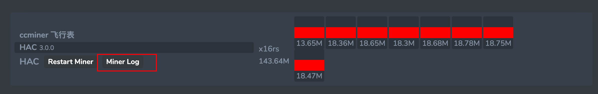

## 查看日志

#### 方法1：通过网站提供的功能查看

登录系统后，点开具体某个矿机，然后选择 `Miner Log` 按钮，可以查看最近的日志




#### 方法2：通过命令查看

先连接矿机的命令行界面，然后输入以下命令查看

有两种方式可以连接矿机的命令行界面

```sh
## 查看日志
os logs
```


```sh
## 使用示例
## 输入 os logs 后会提示以下信息
## 这个输出表示这台矿机应用了两个飞行表，同时挖 HAC 和 ORE
## 使用 screen -r os_miner_HAC 命令查看 HAC 挖矿软件的日志
## 使用 screen -r os_miner_ORE 命令查看 ORE 挖矿软件的日志
root@ll-02:/home/user# os logs
Use the following command to view the logs (使用以下命令查看日志):
screen -r os_miner_HAC
screen -r os_miner_ORE

To exit the viewing session, use Ctrl + A, then D to detach from the screen
如果要结束查看并返回后台，请按下 Ctrl + A，然后再按 D，即可退出 screen 会话而不关闭程序
```


