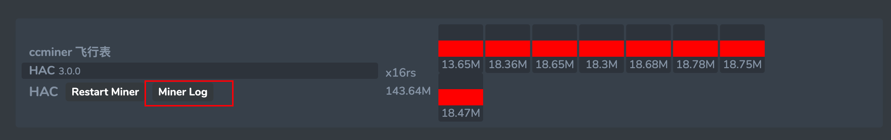

## View Logs

#### Method 1: View via Web Interface

After logging into the system, click on a specific miner, then select the `Miner Log` button to view the recent logs.



#### Method 2: View via Command Line

First, connect to the command-line interface of the miner, then enter the following command to view the logs.

Introduction to Methods for Connecting to Miner via SSH：https://gitee.com/minerx-vip/doc/blob/main/help/help_ssh_en.md

There are two ways to access the miner's command-line interface.

```sh
## View logs
os logs
```


```sh
## Example
## After entering os logs, the following message will appear
## This output means the miner is running two flight sheets to mine HAC and ORE
## Use the command screen -r os_miner_HAC to view the HAC mining software logs
## Use the command screen -r os_miner_ORE to view the ORE mining software logs
root@ll-02:/home/user# os logs
Use the following command to view the logs (使用以下命令查看日志):
screen -r os_miner_HAC
screen -r os_miner_ORE

To exit the viewing session, use Ctrl + A, then D to detach from the screen
如果要结束查看并返回后台，请按下 Ctrl + A，然后再按 D，即可退出 screen 会话而不关闭程序
```


