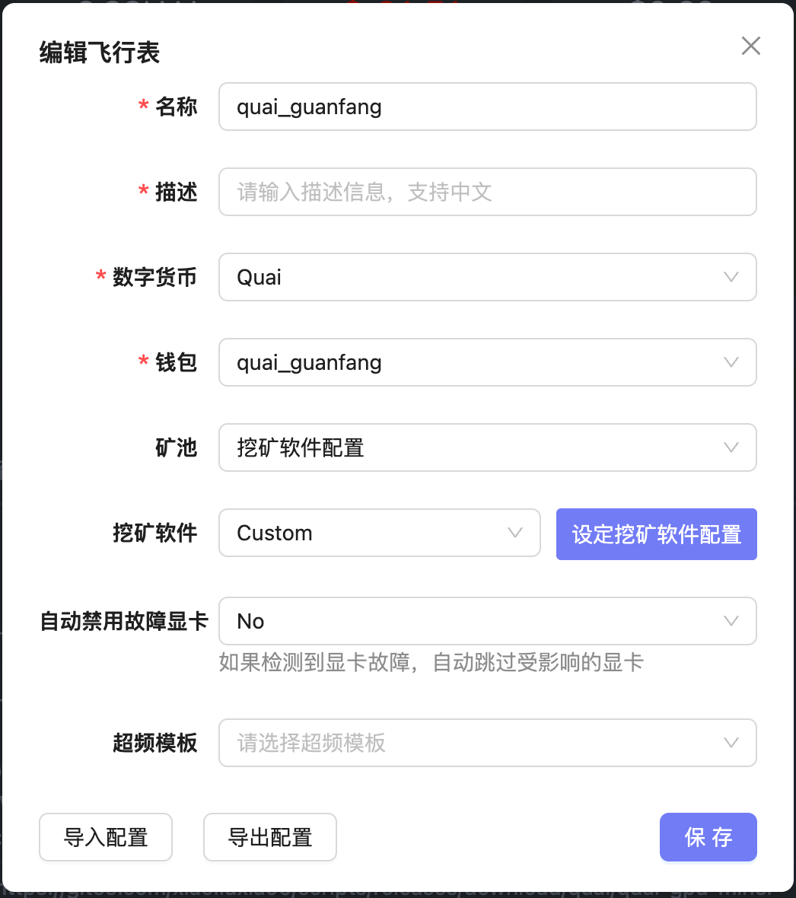
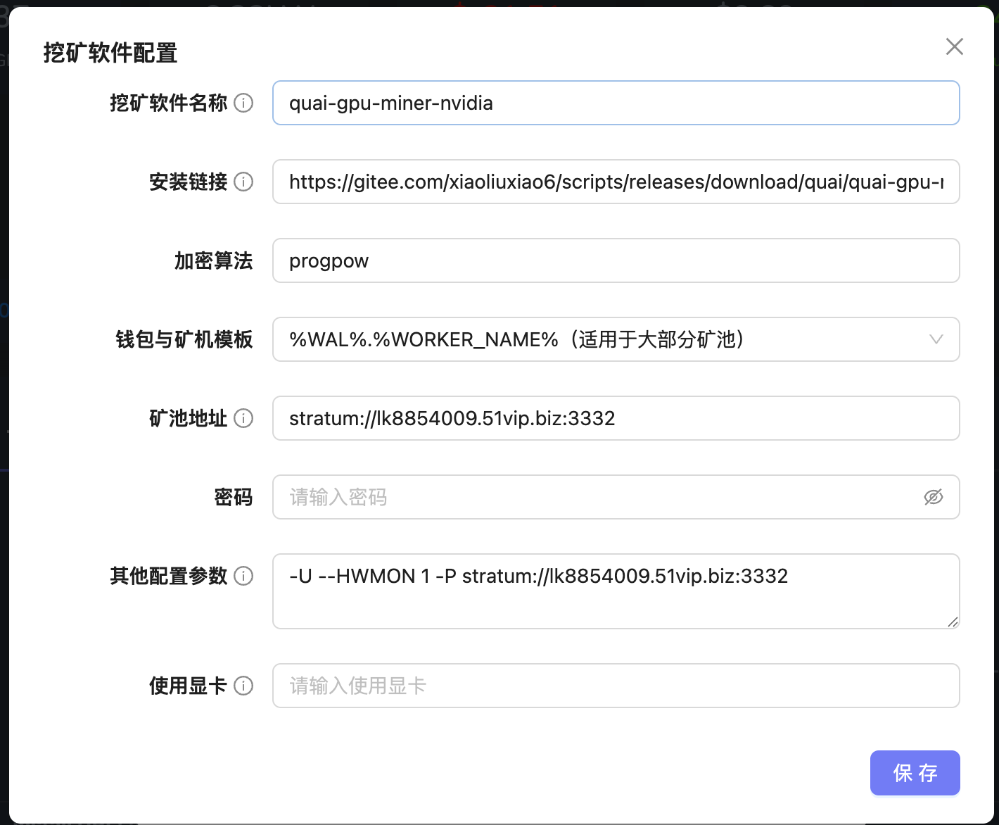
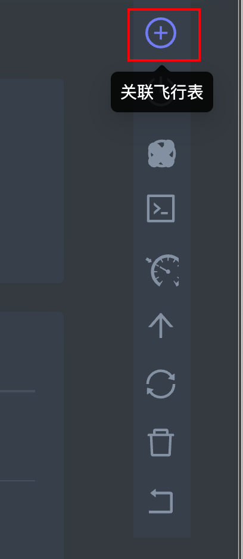
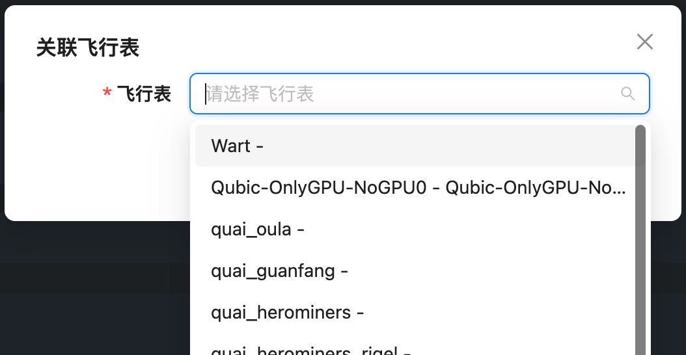
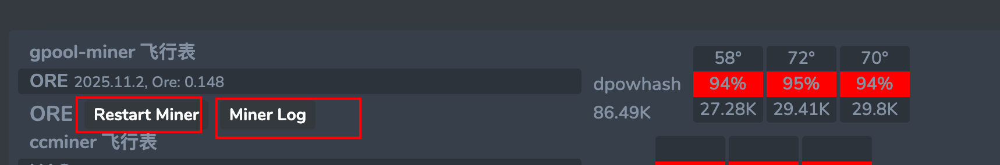

## 飞行表使用

使用流程：

- 1.首先创建钱包
- 2.创建飞行表
  - 同时可以选择需要绑定的超频模板
  - 和需要使用所有显卡还是指定显卡
- 3.将飞行表应用于矿机
  - 如果指定了超频模板，会在运行挖矿执行先运行超频参数，超频参数执行成功后才会开始启动挖矿程序
  - 超频模板可以针对显卡型号来指定超频参数，对混插显卡支持友好
  - 支持一台矿机多个飞行表，以适用于 CPU + GPU 双挖，或者不同显卡挖不同矿的需求

#### 1.创建钱包

在创建飞行表之前，首先需要先创建好对应的钱包

如果在数字货币部分下拉框内没有现成的可选的话，可以点击右边 `+` 来手动添加 

- 1.登录系统
- 2.选择钱包
- 3.新增钱包
- 4.选择对应的数字货币、输入钱包地址和钱包名称保存

#### 2.参数说明 - 主页面

- 名称：为此飞行表起个名字，只能是英文和数字的组合，切必须英文字母开头
- 描述：描述信息，支持中文
- 数字货币：上一步创建钱包时候选择的 [数字货币]
- 钱包：需要使用的钱包
- 矿池：只能选择 [挖矿软件配置]
- 挖矿软件：只能选择 [Custom]
- 自动禁用故障显卡：如果选择 Yes 的话，发生掉卡的时候会自动跳过有问题的显卡，而不至于让所有显卡都没有算力
- 超频模板：选择在运行挖矿软件之前需要应用的超频模板
  - 超频模板可以为每种型号的显卡分别设置超频参数，即便有显卡混插也不影响

#### 3.参数说明 - 挖矿软件配置

- 挖矿软件名称：
- 安装链接：飞行表下载地址
- 加密算法：指定需要使用的挖矿算法
- 钱包与矿机模板：支持以下模板，根据不同飞行表情况来指定
  - `%WORKER_NAME%"`
  - `%WAL%.%WORKER_NAME%`
  - `%WAL%"`

- 矿池地址：指定矿池地址
- 密码：有些矿池需要指定密码，否则留空
- 其他配置参数：
- 使用显卡：如果使用所有显卡留空，或者指定需要使用的显卡列表，以英文逗号分隔 (`,`)
  - ID 是从0开始，例如使用第1、2、3张显卡则指定：`0,1,2`

#### 4.将飞行表应用到矿机

支持一台矿机多个飞行表，以适用于 CPU + GPU 双挖，或者不同显卡挖不同矿的需求

- 方式1：在矿机列表页面多选矿机后，选择右上角的 + 图标对多个矿机绑定
- 方式2：在矿机详情页面，选择右上角的 + 图标对当前矿机进行绑定

#### 4.常用操作

可以在矿机详情页面使用以下两个按钮来重启锄头和查看日志操作

