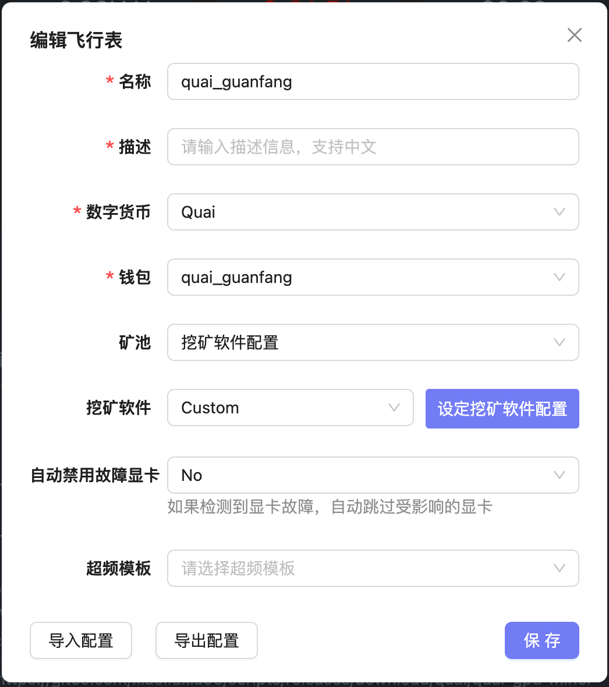
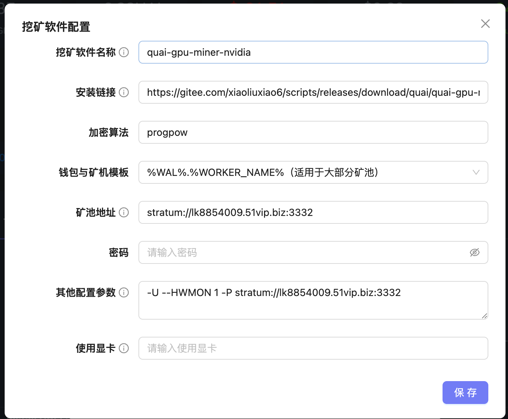
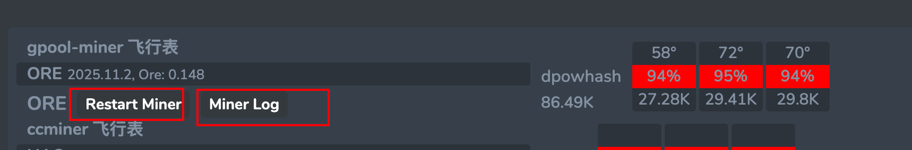

## Flight Sheet Usage

Usage Process:

- 1. First, create a wallet
- 2. Create a flight sheet
  - You can optionally bind an overclocking template
  - Choose whether to use all GPUs or specify certain ones
- 3. Apply the flight sheet to miners
  - If an overclocking template is specified, it will run before the mining program. Mining will only start after successful overclocking.
  - Overclock templates can set parameters by GPU model, making them friendly to mixed GPU setups
  - One miner can use multiple flight sheets, suitable for CPU + GPU dual mining, or different GPUs mining different coins

#### 1. Create Wallet

Before creating a flight sheet, you need to create the corresponding wallet.

If no options are available in the cryptocurrency dropdown, click the `+` on the right to add manually.

- 1. Log in to the system
- 2. Select "Wallet"
- 3. Add a new wallet
- 4. Choose the corresponding cryptocurrency, enter wallet address and name, then save

#### 2. Parameter Explanation - Main Page

- Name: Name for this flight sheet; must start with a letter and contain only letters and numbers
- Description: Description info; supports Chinese
- Cryptocurrency: The [cryptocurrency] selected when creating the wallet
- Wallet: The wallet to be used
- Mining Pool: Must choose from [Mining Software Config]
- Mining Software: Must choose [Custom]
- Auto-disable Faulty GPU: If set to Yes, any problematic GPU will be skipped automatically in case of GPU drop, instead of disabling the entire rig
- Overclock Template: Overclock template to apply before launching the miner
  - Overclock templates can be set per GPU model, working well with mixed GPU setups

#### 3. Parameter Explanation - Mining Software Config

- Mining Software Name:
- Install URL: The flight sheet download link
- Algorithm: The mining algorithm to be used
- Wallet and Worker Name Template: Supports the following templates, depending on the flight sheet:
  - `%WORKER_NAME%"`
  - `%WAL%.%WORKER_NAME%`
  - `%WAL%"`

- Mining Pool URL: Specify the mining pool address
- Password: Required for some pools, otherwise leave blank
- Other Parameters:
- GPUs to Use: Leave blank to use all GPUs, or specify GPU indices separated by commas (`,`)
  - IDs start from 0. For example, to use GPU 1, 2, and 3: `0,1,2`

#### 4. Apply Flight Sheet to Miners

One miner can use multiple flight sheets, suitable for CPU + GPU dual mining or mining different coins with different GPUs.

- Method 1: On the miner list page, select multiple miners, then click the `+` icon in the top right to bind flight sheets
- Method 2: On the miner detail page, click the `+` icon in the top right to bind flight sheets to the current miner

#### 5. Common Operations

You can use the following two buttons on the miner detail page to restart the miner or view logs

