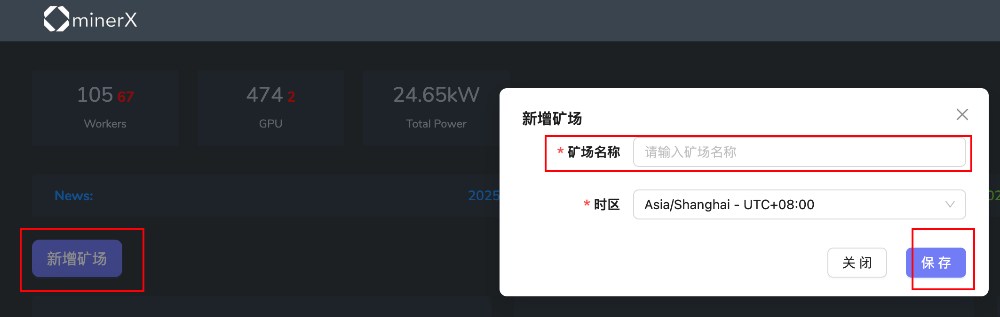
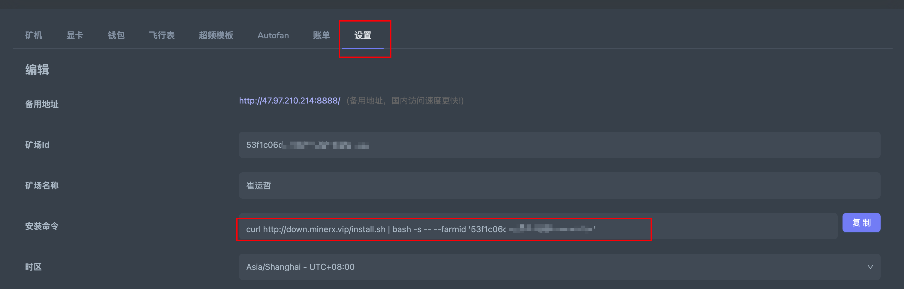

## Installation Guide

minerX is a HiveOS-like management system. In addition to offering the same functionalities as HiveOS, it also improves certain user experiences.

All minerX client-side code is fully open source, transparent, and secure.

minerX can be used by directly installing the client on existing operating systems — **no need to reinstall your OS**.

minerX **supports both native Ubuntu and HiveOS operating systems**.

minerX **supports native HiveOS flight sheets directly**, and we also regularly update some pre-configured flight sheets for new coins.

If no suitable flight sheet is available, feel free to contact an admin to help create one quickly.

#### 1. First, register an account, log in to the system, and create a mining farm

#### 2. In [Mining Farm] - [Settings], copy the [Installation Command]

Then run this command on the machine you want to manage.

