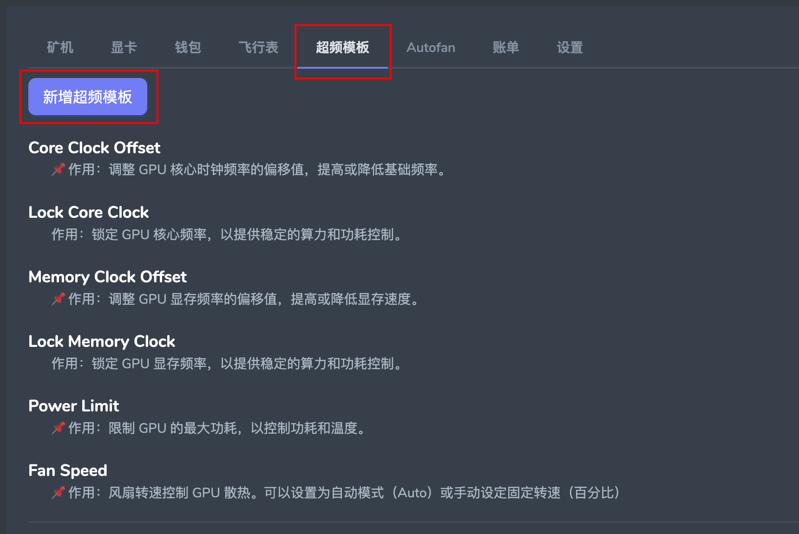
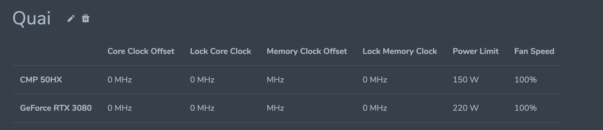

## 显卡超频

可以从两个地方来设置显卡超频参数

- 方式1：设置超频模板，然后将其跟飞行表绑定
- 方式2：为每台矿机的每张显卡单独设置超频参数

#### 1.超频参数说明

- **Core Clock Offset**
  - 📌 作用：调整 GPU 核心时钟频率的偏移值，提高或降低基础频率。

- **Lock Core Clock**
  - 作用：锁定 GPU 核心频率，以提供稳定的算力和功耗控制。

- **Memory Clock Offset**
  - 📌 作用：调整 GPU 显存频率的偏移值，提高或降低显存速度。

- **Lock Memory Clock**
  - 📌 作用：锁定 GPU 显存频率，以提供稳定的算力和功耗控制。

- **Power Limit**
  - 📌 作用：限制 GPU 的最大功耗，以控制功耗和温度。

- **Fan Speed**
  - 📌 作用：风扇转速控制 GPU 散热。可以设置为自动模式（Auto）或手动设定固定转速（百分比）

#### 2.设置超频方法1：超频模板使用

这种方式适用于有大量机器需要管理，并且存在**显卡混插**的情况，或者**每台机器需要不同的显卡来挖不同矿，而不不同矿又想应用不同的超频参数**

**超频模板需要跟飞行表绑定使用**。在创建飞行表的时候选择需要应用的超频模板

- 1.登录系统

- 2.选择超频模板

- 3.新增超频模板，并为其起个名字

- 4.为每种型号的显卡都设置好超频参数

- 5.在建立飞行表的时候，将其跟飞行表绑定

- 6.在飞行表启动之前，会先根据本机上显卡型号来应用不同的超频参数。

- 7.成功应用超频参数后才会开始启动挖矿程序

#### 3.设置超频方法2：为每台矿机的每张显卡单独设置超频参数

这种方式适用于机器数量较少，希望精确控制的用户

可以方便的为每台机器的每张显卡来设置不同的超频参数

- 1.登录系统
- 2.点开具体某个矿机
- 3.点击显卡列表最后一列的超频按钮来为所有显卡后单独显卡设置超频参数

