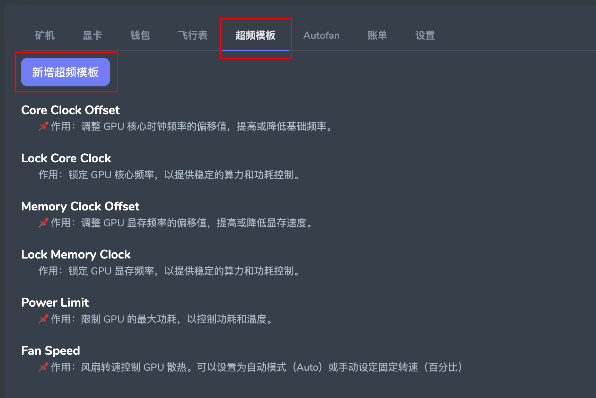
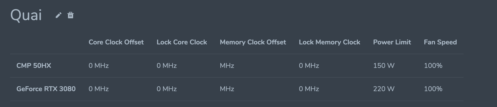
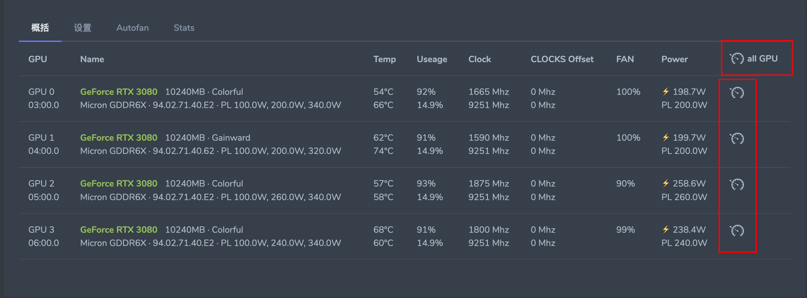

## GPU Overclocking

You can configure GPU overclocking parameters in two ways:

- Method 1: Set up an overclocking template and bind it to a flight sheet
- Method 2: Configure overclocking parameters individually for each GPU on each miner


#### 1. Overclocking Parameter Descriptions

- **Core Clock Offset**
  - 📌 Purpose: Adjusts the GPU core clock frequency offset to increase or decrease the base frequency.

- **Lock Core Clock**
  - Purpose: Locks the GPU core clock to provide stable hashrate and power control.

- **Memory Clock Offset**
  - 📌 Purpose: Adjusts the memory clock frequency offset to increase or decrease memory speed.

- **Lock Memory Clock**
  - 📌 Purpose: Locks the GPU memory frequency to ensure stable performance and power control.

- **Power Limit**
  - 📌 Purpose: Limits the GPU's maximum power consumption to control power usage and temperature.

- **Fan Speed**
  - 📌 Purpose: Controls the GPU fan speed. You can set it to automatic mode (Auto) or a fixed manual percentage.


#### 2. Overclocking Method 1: Using Overclocking Templates

This method is suitable when managing a **large number of miners**, especially with **mixed GPU models**, or when **different GPUs are mining different coins with different overclocking needs**.

**Overclocking templates must be bound to a flight sheet**. Select the desired template when creating a flight sheet.

- 1. Log in to the system

- 2. Navigate to Overclock Templates

- 3. Add a new overclocking template and give it a name

- 4. Set overclocking parameters for each GPU model

- 5. Bind the template to the flight sheet during creation

- 6. Before the flight sheet starts mining, it will apply the overclocking parameters based on detected GPU models on the machine

- 7. Mining will only start after overclocking parameters are successfully applied








#### 3. Overclocking Method 2: Per-GPU Overclocking on Each Miner

This method is more suitable for users with fewer miners who want **precise control**.

It allows convenient configuration of different overclocking settings for each GPU on each machine.

- 1. Log in to the system
- 2. Open a specific miner
- 3. Click the overclocking button in the last column of the GPU list to configure overclocking for all or individual GPUs





#### 4.Apply Overclocking Only Without Running a Flight Sheet

This flight sheet applies only the overclocking settings from the template and does **not** launch any mining workload.

Recommended for scenarios where you want to centrally manage overclocking, but run other workloads manually.

Create a wallet using the following information, then import the flight sheet:

- **Coin**: IDLE

- **Wallet Address**: IDLE

- **Wallet Name**: IDLE

```json
{
    "flightName": "Idle",
    "descMsg": "Idle",
    "digitalCash": "IDLE",
    "miningPool": "1",
    "miningConfig": "Custom",
    "disableFaultCard": false,
    "customConfig": {
        "customMiner": "idle",
        "customInstallUrl": "https://minerx-download.oss-cn-shanghai.aliyuncs.com/idle/idle-1.0.2.tar.gz",
        "customAlgo": "---",
        "customTemplate": "%WAL%.%WORKER_NAME%"
    }
}
```

