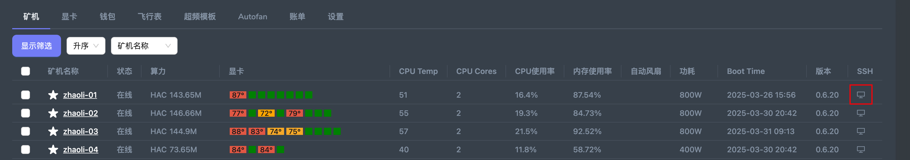
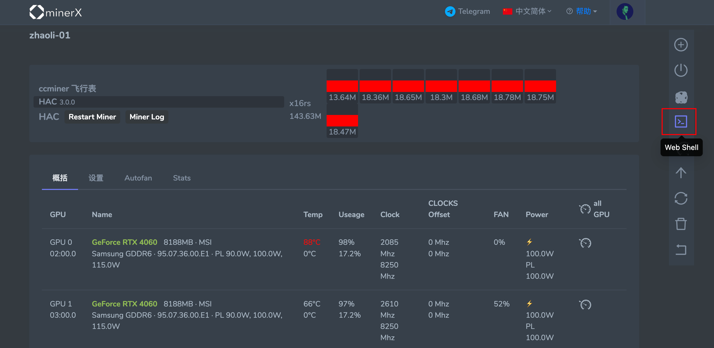
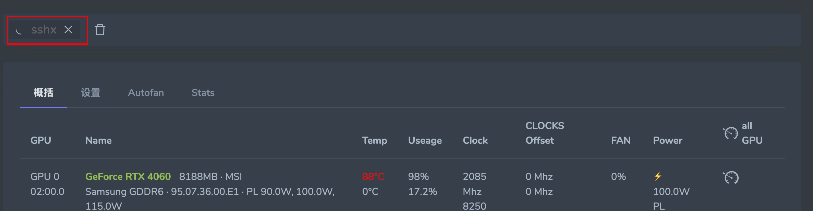
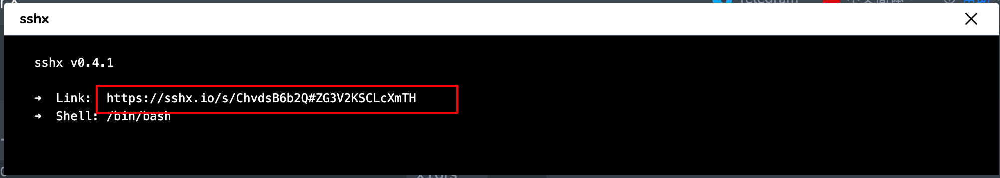

## 使用 SSH 连接矿机

有以下两种方式可以方便的连接矿机的 SSH 进行管理

#### 方式1：内网方式

在矿机列表页面点击最后一列的 SSH 图标

**优点**： 通过内网地址直接连接矿机，不需要走外网流量，操作会更流程

**缺点**：需要当前操作的机器跟矿机在一个局域网内，且需要手动输入账号密码

#### 方式2：外网方式

- 1.在矿机详情页面点击 Web Shell 按钮 (图1)
- 2.等待连接成功 (图2)，后点击 `sshx` 按钮
- 3.在弹出窗口中复制 Link 后边的地址 (图3)，并粘贴到浏览器

**优点**：随时随时可以连接，不受网络限制。

**缺点**：需要走外网流量，操作上不如第一种方式流畅

